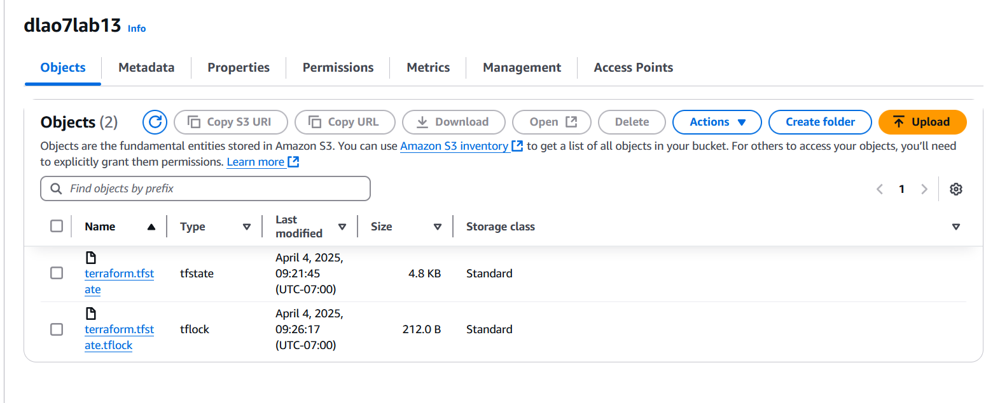

### ACIT 4640 Lab 13

***Questions***

1. The state file is created after running terraform apply.
2. The lock file is present when the terraform apply command is running (for example, after a change to a terraform plan).
3. The lock file is removed after the lock is not needed (ie. There is no command running that alters the tfstate).

